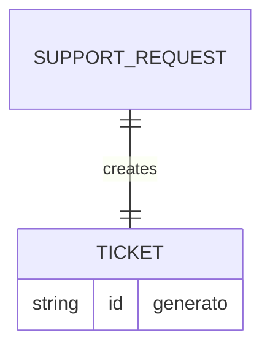

# Data Sketch - Create Ticket

## Prima Di Compilare

Un data sketch e' una classificazione dei campi prima dello schema definitivo.

Serve a decidere quali dati sono accettati, generati, respinti o ancora mancanti.

Il Mermaid finale visualizza solo campi e relazioni gia' motivati nella tabella.

Non usare questo file per progettare tutto il database o accettare campi non collegati a issue e contract.

## Come Scegliere Lo Stato Del Campo

| Stato | Usalo quando | Domanda di controllo |
| --- | --- | --- |
| accettato | il campo arriva dall'input e serve al primo slice | chi lo inserisce? |
| generato | il sistema crea il valore | quando viene creato? |
| respinto | il campo e' fuori scope o non motivato | quale vincolo lo esclude? |
| mancante | il campo potrebbe servire, ma manca una decisione | chi deve chiarirlo? |

Se non sai motivare un campo, non metterlo nel Mermaid: lascialo `mancante` o `respinto`.

## Scopo

Classificare i dati prima di chiedere codice.

## Campi

| Campo | Stato | Motivo | Fonte |
| --- | --- | --- | --- |
| `title` | accettato / respinto / generato / mancante | [perche'] | issue / contract / decisione / inferenza |
| `description` | accettato / respinto / generato / mancante | [perche'] | issue / contract / decisione / inferenza |
| `priority` | accettato / respinto / generato / mancante | [perche'] | issue / contract / decisione / inferenza |
| `area` | accettato / respinto / generato / mancante | [perche'] | issue / contract / decisione / inferenza |
| `status` | accettato / respinto / generato / mancante | [perche'] | issue / contract / decisione / inferenza |
| `id` | accettato / respinto / generato / mancante | [perche'] | issue / contract / decisione / inferenza |
| `attachments` | accettato / respinto / generato / mancante | [perche'] | issue / contract / decisione / inferenza |
| `owner` | accettato / respinto / generato / mancante | [perche'] | issue / contract / decisione / inferenza |
| `createdAt` | accettato / respinto / generato / mancante | [perche'] | issue / contract / decisione / inferenza |

## Mermaid Leggero

Usa Mermaid solo per visualizzare la relazione minima. Non trasformarlo in schema DB definitivo.

Campi mostrati nel diagramma:

- [campo] - [accettato/generato/respinto/mancante]
- [campo] - [accettato/generato/respinto/mancante]

## Campi Scartati O Rimandati

| Campo | Decisione | Motivo |
| --- | --- | --- |
| [campo] | respinto / rimandato | [motivo] |
| [campo] | respinto / rimandato | [motivo] |
| [campo] | respinto / rimandato | [motivo] |

## Domande Per L07

- [quale file potrebbe contenere questi dati?]
- [quale naming andra' verificato nella repo?]
- [quale campo dipende da una decisione non presa?]
